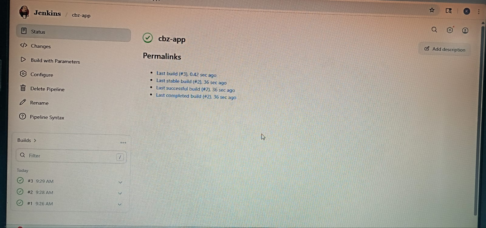
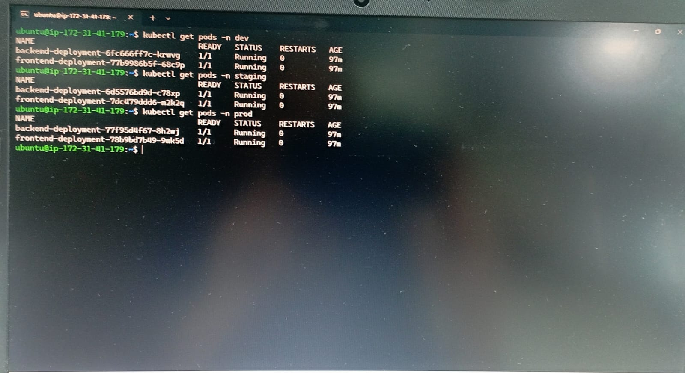
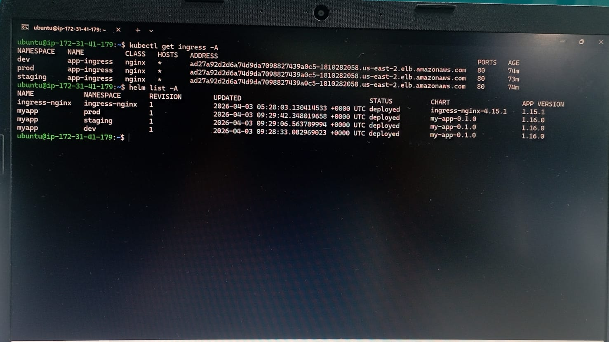
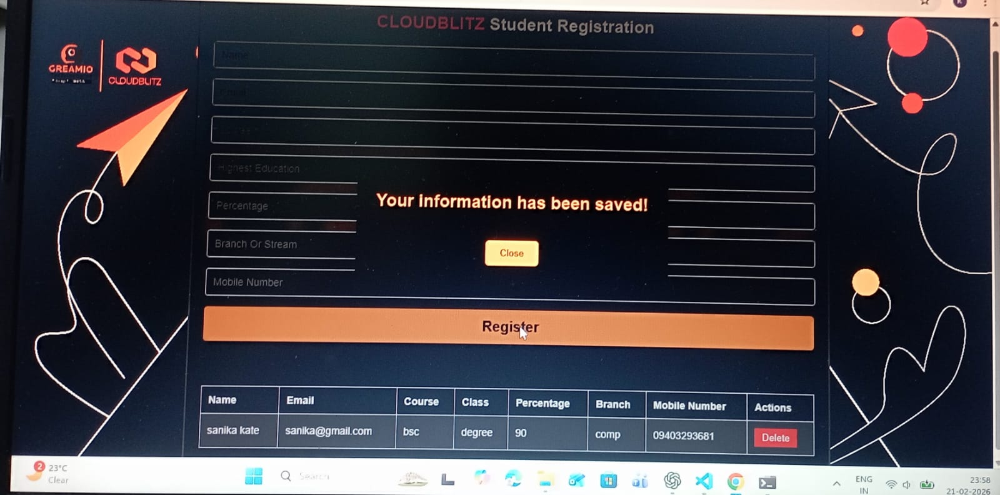

# 🚀 Multi-Environment DevOps Deployment

## 🎯 Highlights

* 🚀 Deployed on AWS EKS with real-world architecture
* 🔁 Automated CI/CD using Jenkins
* 📦 Helm-based multi-environment deployments
* 🌐 Production-style Ingress routing using AWS ELB
* 🗄️ Integrated AWS RDS for persistent database storage

---

## 📌 Project Overview

This project demonstrates a **production-style DevOps pipeline** where a full-stack application (frontend + backend) is containerized, deployed to Kubernetes (AWS EKS), and managed across **multiple environments (Dev, Staging, Prod)** using **Helm and Jenkins CI/CD**.

---

## 🏗️ Architecture

```
User (Browser)
      ↓
AWS ELB (LoadBalancer)
      ↓
NGINX Ingress Controller
      ↓
Path-based Routing + Rewrite
      ↓
-------------------------------------
|     /dev       → Dev Environment   |
|     /staging   → Staging Env       |
|     /          → Production Env    |
-------------------------------------
      ↓
Kubernetes Services
      ↓
Pods (Frontend + Backend)
      ↓
AWS RDS (Database)
```

---

## 📸 Screenshots

| Jenkins Pipeline              | Kubernetes Pods           |
| ----------------------------- | ------------------------- |
|  |  |

| Ingress Routing              | Application UI           |
| ---------------------------- | ------------------------ |
|  |  |

---

## 🌐 Environments & Access

| Environment | URL                                                                                    |
| ----------- | -------------------------------------------------------------------------------------- |
| 🟢 Dev      | http://ad27a92d2d6a74d9da7098827439a0c5-1810282058.us-east-2.elb.amazonaws.com/dev     |
| 🟡 Staging  | http://ad27a92d2d6a74d9da7098827439a0c5-1810282058.us-east-2.elb.amazonaws.com/staging |
| 🔵 Prod     | http://ad27a92d2d6a74d9da7098827439a0c5-1810282058.us-east-2.elb.amazonaws.com/        |

---

## ⚙️ Tech Stack

### 🚀 DevOps Tools

* AWS EKS (Kubernetes)
* Helm (Templating & deployments)
* Jenkins (CI/CD pipeline)
* Docker (Containerization)

### 🌐 Networking

* NGINX Ingress Controller
* AWS ELB (LoadBalancer)

### 💻 Application

* Frontend: React / Vite
* Backend: Node.js (Express)
* Database: AWS RDS (Relational Database Service)

---

## 🗄️ Database

* Application uses **AWS RDS** for persistent data storage
* Backend services connect securely to the RDS instance
* Ensures data durability beyond pod lifecycle

---

## 📂 Project Structure

```
cloudblitz-app/
│
├── frontend/
├── backend/
│
├── my-app/
│   ├── templates/
│   ├── values.yaml
│
├── env/
│   ├── dev-values.yaml
│   ├── staging-values.yaml
│   ├── prod-values.yaml
│
├── Jenkinsfile
├── screenshots/
├── README.md
```

---

## 🔁 CI/CD Pipeline Flow

1. Code pushed to GitHub
2. Jenkins pipeline triggered
3. Docker images built
4. Images pushed to Docker Hub
5. Helm deploys updated images to EKS
6. Ingress routes traffic to correct environment

---

## 📦 Helm Deployment

```bash
helm upgrade --install myapp ./my-app -f env/dev-values.yaml -n dev
helm upgrade --install myapp ./my-app -f env/staging-values.yaml -n staging
helm upgrade --install myapp ./my-app -f env/prod-values.yaml -n prod
```

---

## 🌐 Ingress Configuration

* Uses **NGINX Ingress Controller**
* Implements **path-based routing**
* Uses **rewrite rules**

| Path     | Routes To           |
| -------- | ------------------- |
| /dev     | Dev frontend        |
| /dev/api | Dev backend         |
| /staging | Staging frontend    |
| /        | Production frontend |

---

## 🚀 Deployment Strategy

Kubernetes rolling updates are used to ensure zero downtime deployments.

---

## 🔐 Security Considerations

* Sensitive data (AWS keys, `.env`, kubeconfig) excluded via `.gitignore`
* Jenkins credentials securely stored
* No secrets exposed in the repository

---

## 📈 Outcome

Successfully built a scalable, production-like multi-environment deployment system using Kubernetes, Helm, and Jenkins CI/CD with integrated cloud database support.

---

## 🧠 What I Learned

* Designing multi-environment Kubernetes deployments
* Using Helm for dynamic configuration
* Implementing CI/CD pipelines with Jenkins
* Debugging Ingress and networking issues
* Managing path-based routing and URL rewrites
* Integrating AWS RDS with containerized applications

---

## 🚀 Future Enhancements

* 🔐 Add HTTPS using cert-manager
* 🌐 Configure custom domain using AWS Route53
* 📊 Add monitoring (Prometheus + Grafana)
* 🔍 Centralized logging (ELK stack)
* ⚙️ Infrastructure as Code (Terraform)


